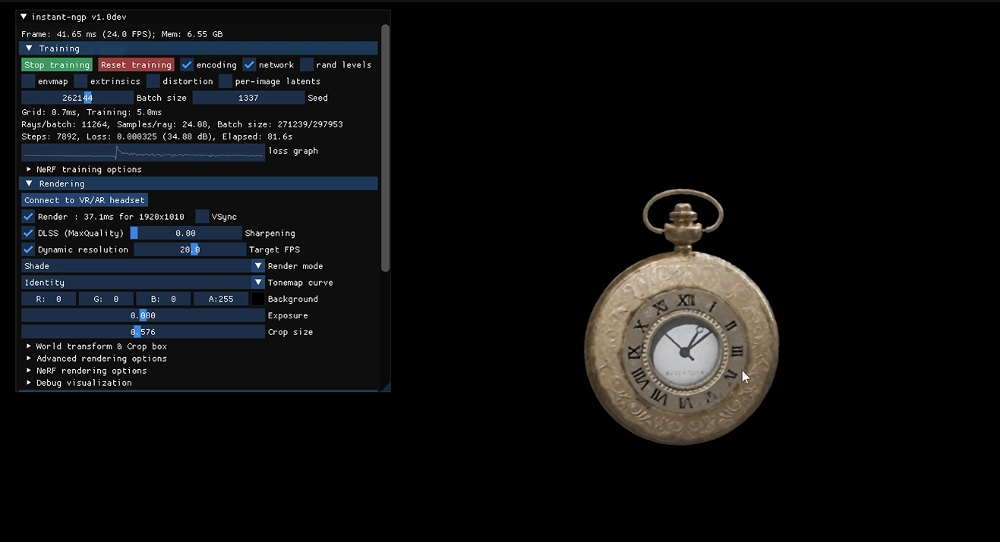
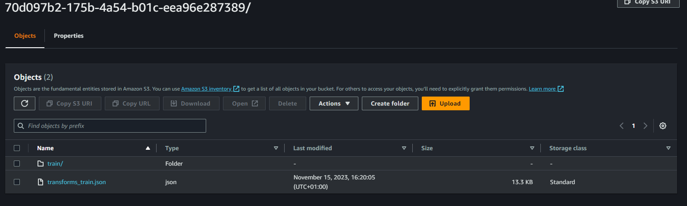
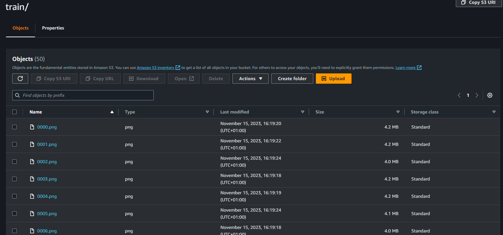
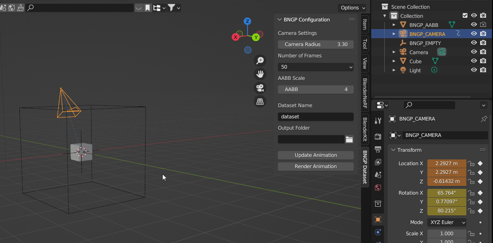
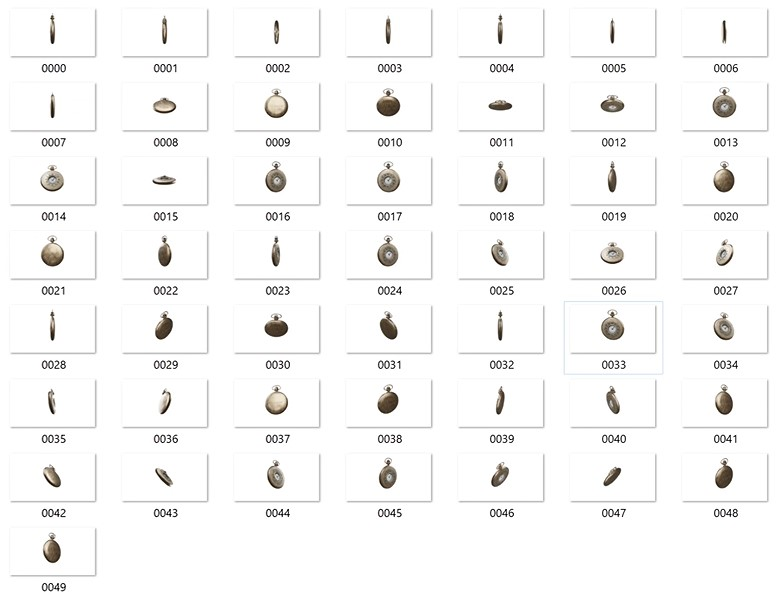

# Blender Synthetic Dataset Instant-NGP - AWS Batch



_Instant-ngp_ - [GitHub - NVlabs/instant-ngp: Instant neural graphics primitives](https://github.com/NVlabs/instant-ngp)

## Description

This repository contains the code and Dockerfile to generate a synthetic dataset for [Instant-NGP](https://github.com/jer-nc/instant-ngp-blender-addon) using [Blender](https://www.blender.org/) and [AWS Batch](https://aws.amazon.com/batch/).

> Note: The Docker image contains the .blend scene, for now, this logic works according to the scene contained in the Docker image.





## Prerequisites

Before running the synthetic dataset generation process, make sure to install the necessary dependencies and set up the required environment.

### Blender Addon

You need to work with the scene `.blend` using the [instant-ngp-blender-addon](https://github.com/jer-nc/instant-ngp-blender-addon). This addon is responsible for generating camera animations around a 3D object.

| Blender Addon                         | Dataset                               |
| ------------------------------------- | ------------------------------------- |
|  |  |

### Dockerfile

The Dockerfile provided in this repository sets up the environment with the required dependencies. It includes:

- Ubuntu 22.04 as the base image.
- Blender version 4.0 downloaded from [Blender official releases](https://www.blender.org/download/).
- Additional dependencies for Blender and Python.

> Note: Currently, the .blend scene is configured with an animation of 50 frames, 5 samples, and a 4k resolution.

## Building and Pushing Docker Image to Amazon ECR

To use this Docker image with AWS Batch, you need to build it and push it to Amazon Elastic Container Registry (ECR).

### Build Docker Image

```bash
docker build -t blender-synthetic-dataset .
```

### Authenticate Docker to Your ECR Registry

```bash
aws ecr get-login-password --region <your-region> | docker login --username AWS --password-stdin <your-account-id>.dkr.ecr.<your-region>.amazonaws.com
```

### Create an ECR Repository

```bash
aws ecr create-repository --repository-name blender-synthetic-dataset --region <your-region>
```

### Tag and Push the Docker Image

```bash
docker tag blender-synthetic-dataset:latest <your-account-id>.dkr.ecr.<your-region>.amazonaws.com/blender-synthetic-dataset:latest
docker push <your-account-id>.dkr.ecr.<your-region>.amazonaws.com/blender-synthetic-dataset:latest
```

Replace `<your-region>` and `<your-account-id>` with your AWS region and account ID.

## Usage

### Running the Docker Container on AWS Batch

To run the Docker container and generate the synthetic dataset using AWS Batch, refer to the AWS Batch documentation and use the ECR URI for the Docker image in your job definition.

## AWS Batch Integration

The `app.py` script serves as the entry point for AWS Batch jobs. It handles the array job logic and orchestrates the rendering process.

### Array Job Information

The following environment variables are set by AWS Batch and can be accessed within the script:

- `AWS_BATCH_JOB_ARRAY_INDEX`: Index of the array job.
- `AWS_BATCH_JOB_ARRAY_SIZE`: Size of the array job.
- `AWS_BATCH_JOB_ID`: Unique identifier for the job.

### Rendering and Uploading to S3

The `render.py` script renders individual frames, and the `cameras_ngp.py` script generates camera transforms. The results are uploaded to an S3 bucket named 'blender-batch-render.'

Adjust the S3 bucket name and paths in the scripts according to your setup.

## Authors

- [jer-nc](https://github.com/jer-nc)
- [david-blg](https://github.com/david-blg)

## References

- AWS Batch CDK Blender: [cdk-blender-render](https://github.com/mattiamatrix/cdk-blender-render).
- BlenderNerf Repo - [BlenderNerf Github](https://github.com/maximeraafat/BlenderNeRF)
- GitHub - NVlabs/instant-ngp: Instant neural graphics primitives https://github.com/NVlabs/instant-ngp.
- Batch Processing - AWS Batch. https://aws.amazon.com/batch/.

## License

This project is licensed under the MIT License - see the [LICENSE](LICENSE) file for details.